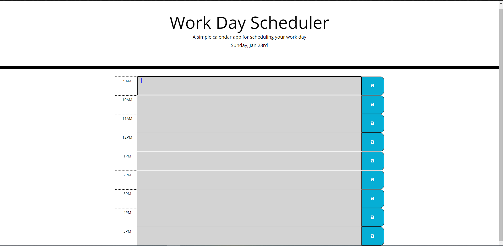

# Work Day Scheduler

A planner app for creating business day schedule

## Function:
Scroll down to interact with the business-hour calendar
Blocks are colored according to past-present, or future
Clicking on time blocks allows for entering events
You can save the blocks to local storage with the buttons to their right

## Tools Used:

- VSCode
- JavaScript
- Node.JS
- jQuery
- moment.js

## Website:

https://raymondcerneytech.github.io/Work-Day-Scheduler/

### Preview:

### Author:

Raymond Cerney

### License

This project is licensed under [MIT](https://opensource.org/licenses/MIT)

### Contact:

cerne004@gmail.com

LinkedIn: https://www.linkedin.com/in/raymondcerney/
